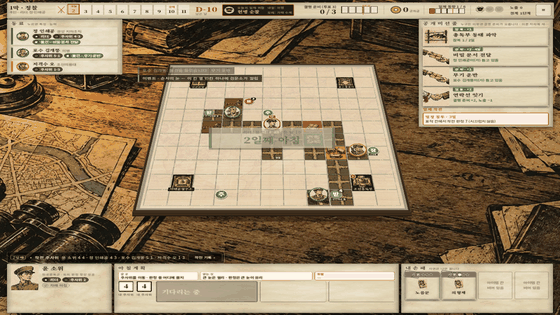
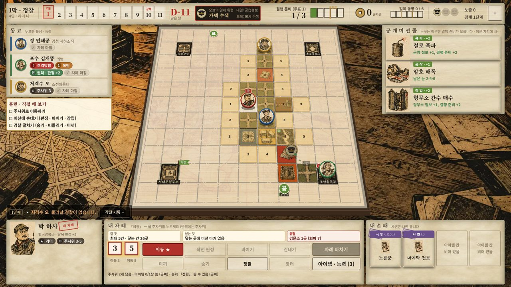
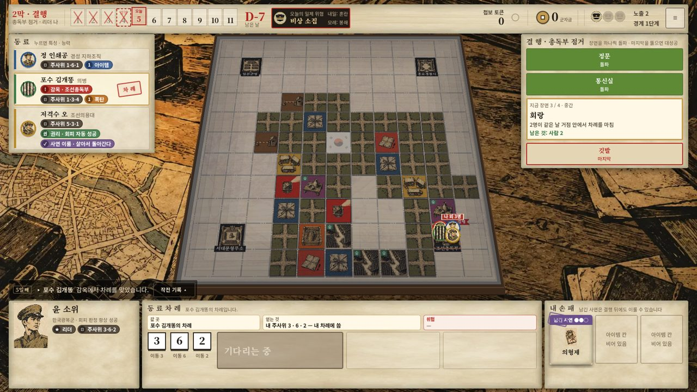
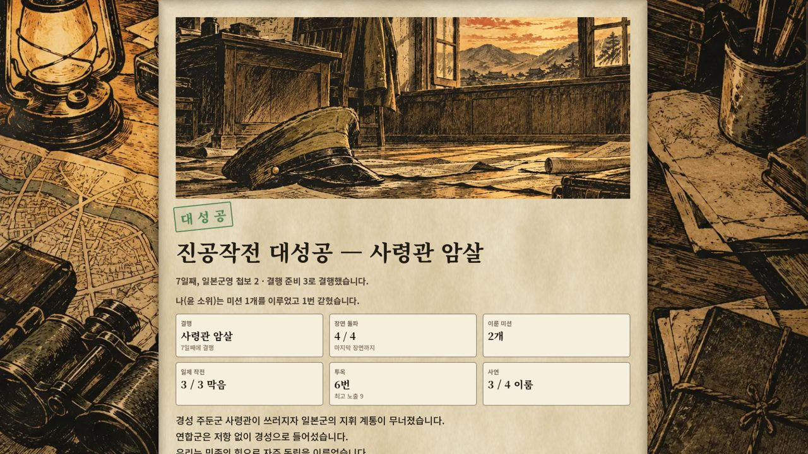
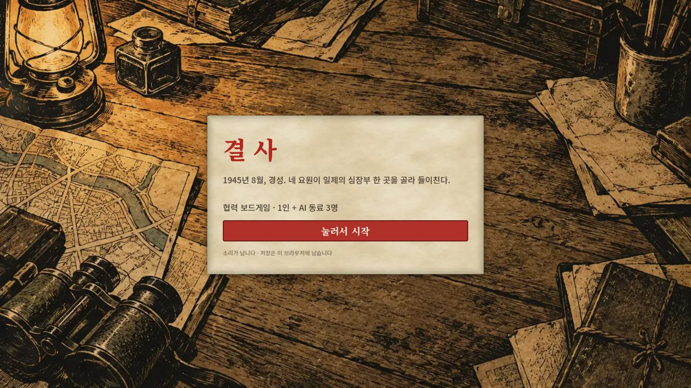

# 결사 — 1945, 경성

> 해방을 앞둔 1945년 8월의 경성. 네 요원이 일제의 심장부 한 곳을 골라 들이치는 **협력 보드게임의 디지털판**입니다.
> 1인 + AI 동료 3명으로 브라우저에서 바로 하고, 온라인 방에서는 사람끼리 합니다. (Godot 4.7)

**▶ 브라우저에서 하기: [yong124.itch.io/gyeolsa](https://yong124.itch.io/gyeolsa)** · 📁 **기획 포트폴리오: [`portfolio/`](portfolio/)** (소개 · 설계 사례 6 · 밸런스 보고 · 규칙서, 내려받아 `index.html`을 열면 됩니다)



| 내 차례: 행동을 고르면 쓸 주사위가 반짝임 | 2막: 결행 장면 돌파 |
|---|---|
|  |  |
| **결과별 엔딩: 원인 · 내 몫 한 문장** | **첫 화면** |
|  |  |

---

## 어떤 게임인가
- **남은 날은 열하루.** 1막에는 덮인 경성 지도를 넓혀 가며 미션을 이루고 첩보를 모읍니다. 결행 준비가 차면 투표로 결행을 선언합니다. 2막에서는 고른 거점(형무소 · 군영 · 경찰서 · 총독부)의 장면을 정문부터 마지막까지 하나씩 돌파합니다.
- **주사위 하나 = 행동 하나.** 매일 아침 요원마다 작전 주사위를 굴립니다. 큰 눈을 멀리 가는 데 쓸지, 작전 판정에 남길지가 매 차례의 고민입니다.
- **압박은 셋입니다.**
  - 노출: 높을수록 경찰이 빨라진다
  - 일제 동향: 막지 못한 작전이 쌓인다
  - 오늘의 위협 카드
  
  시끄러운 일을 하면 경찰이 붙고, 따라잡히면 투옥됩니다.
- **혼자지만 협력 게임입니다.** AI 동료 셋이 주사위를 건네고, 미끼가 되고, 같은 날 함께 장면을 돌파합니다.
- **개인 사연(비밀 목표).** 요원마다 남몰래 품은 사연이 있습니다. 결행의 성패와 사연을 이뤘는지에 따라 후일담이 네 갈래로 갈립니다.

## 기획 포인트
원작 보드게임(학원 팀 과제, 종이 규칙서)을 **디지털 게임으로 다시 기획한 과정**입니다. 단계마다 문제를 적고, 다른 게임을 조사해 후보를 내고, 고른 것을 규칙 문서와 지시서로 쓴 뒤, 구현하고 AI 1,000판으로 쟀습니다. 자세한 사례는 [포트폴리오 설계 사례](portfolio/cases.html).

| 문제 | 결정 | 문서 |
|---|---|---|
| 아침 팀 주사위를 나누는 맛이 1인 + AI에서는 없고, 남는 예비 주사위가 공짜 보너스였다 | Dead of Winter식 **개인 작전 주사위**. 큰 눈을 이동에 쓸까, 판정에 남길까 | [조사](v2_구현/조사_아침주사위_대안.md) · [7단계](v2_구현/7단계_개인주사위.md) |
| 한 차례에 거의 모든 걸 할 수 있어 포기할 것이 없었다 | **주사위 1개 = 행동 1개** | [11단계](v2_구현/11단계_행동_제한.md) |
| 변절은 고르는 사람 없이 카드 2장이면 일어났고, 무게에 비해 재미가 없었다 | **변절을 통째로 빼고** 팀의 긴장(일제 작전 · 노출 · 군자금)으로 채움 | [9단계](v2_구현/9단계_변절_제거.md) |
| 비평: 긴장이 약하다 · 같은 칸 금지가 협력을 막는다 · 2막 막판은 서서 기다린다 | **일제 동향 트랙 · 같은 칸 허용 · 반격 · 결행 혜택**. 목표 밖 지적(온라인 동시 진행)은 미룸 | [12단계](v2_구현/12단계_평가_반영.md) |
| 미션이 「가까운 검은 칸에 가서 굴리기」였다 | 레퍼런스 6개에서 가져와 **지역 마커 + 미션 일곱 종류** | [조사](v2_구현/조사_미션_레퍼런스.md) · [8단계](v2_구현/8단계_미션_타일.md) |
| 처음 공개 뒤 「뭘 눌러야 할지 모르겠다」 | 개념 설명을 먼저 하는 **레슨형 튜토리얼 10개**, 누를 곳만 밝힘 | [T 지시서](v2_구현/지시서/T_튜토리얼.md) |

### 데이터 주도 설계
규칙 수치 · 카드 · 문장은 모두 `game/data/v2/*.json`에 있고, **코드에 카드 id나 밸런스 수치를 쓰지 않습니다.** 새 카드는 JSON만 고쳐서 더합니다. 검증기가 오타 · 모르는 효과 · 빠진 필드를 잡습니다. 파일별 열쇠와 더하는 법은 [데이터_구조.md](v2_구현/데이터_구조.md)

| 파일 | 담는 것 |
|---|---|
| `board.json` | 보드 크기 · 결행 거점 4곳(id · 칸 · 이름) · 지도 · 타일 그림 |
| `rules.json` | 주사위 수 · 판정 목표 · 경찰 속도 · 노출 단계 · 결행 조건 · 투표 통과 규칙 · AI 가중치와 성향 |
| `missions.json` | 미션 22장 + 일제 작전 4장 (조건 · 마커 · 보상 · 보너스) |
| `threats.json` | 위협 카드 22장 (1막 14 · 2막 8) |
| `scenes.json` | 결행 거점 4곳의 장면 · 경비 강화 4장 |
| `characters.json` | 요원 12명 (특성 · 능력 · 대사) |
| `sagas.json` | 개인 사연 20장 + 결과별 후일담 |
| `events.json` · `items.json` · `endings.json` | 이벤트 10 · 아이템 10 · 엔딩 문장 |
| `ui.json` | 행동 단추 구성 · 미션 기본 그림 · 마커 글자 · 날씨 연출 · 훈련 할 일 |
| `online.json` | 온라인 서버 주소 · 시간 · 보안 상한 |

### 측정으로 맞춘 밸런스
`game/tools/v2_balance.gd`로 AI 4명 판을 1,000판씩 돌려 수치를 맞췄습니다. 그래프는 [밸런스 보고](portfolio/balance.html).
- 승률 **53.3%**(목표 45~55%, 다른 시드 53.2%) · 결행 대상별 승률 차이 **6.0%p**(목표 15%p 안) · 요원별 차이 −6.0 ~ +4.4%p
- 엔딩 분포: 성공 533 · 2막 중간에서 멈춤 319 · 마지막 장면에서 멈춤 112 · 시간 끝 36
- 수치로 메우기 전에 원인을 갈랐습니다. 일제 작전을 못 막는 건 기한이 아니라 AI가 마커를 안 쫓아서였고, 수치 대신 AI를 고쳤습니다(28% → 60%).

## 만든 방식
- **원작**: 게임 기획 학원 팀 과제. 저장소 주인이 팀장 · 메인 아이디어
- **기획 · 규칙 개정 · 지시서 · 검수 · 플레이 판단**: 저장소 주인 (디지털판은 혼자)
- **구현**: AI 코딩 도구(Claude Code)가 지시서를 받아 구현 · 시험 · 측정하고, 결과를 보고 문서로 남김
- **그림**: AI 이미지 생성(OpenAI)으로 만들고, 한 장씩 검토해 다시 생성(138장). 미션 카드별 그림 22장 포함. 그림체 기준은 사람이 골랐다. 자세한 기록은 [CREDITS](game/CREDITS.md)
- **소리 · 음악**: 코드로 직접 합성 (외부 음원 없음)

## 실행
- **Godot 4.7.1**에서 `game/project.godot`을 열고 F5
- 명령줄: `godot --path game`

### 시험
```bash
godot --headless --path game --script res://tests/v2_mechanics_test.gd   # 규칙 1,152개
godot --headless --path game --script res://tests/v2_ai_test.gd          # AI 220판 (멈춤 · 반칙 0)
godot --headless --path game --script res://tests/v2_net_test.gd         # 온라인 판 + 보안 시험
godot --headless --path game -- v2uitest 2                              # 화면으로 두 판 끝까지 (넘침 검사)
godot --headless --path game --script res://tools/v2_balance.gd -- games=1000   # 밸런스 측정
```

### 빌드
- 웹(itch.io): `powershell -ExecutionPolicy Bypass -File game\tools\build_web.ps1` → `build/web/`
- 온라인 서버: Render 무료 웹 서비스에 블루프린트(`render.yaml`)로 올린다. 소스를 Godot 헤드리스로 바로 돌린다. 순서는 [서버_배포.md](v2_구현/서버_배포.md)

## 폴더
```
portfolio/           기획 포트폴리오 (소개 · 설계 사례 · 밸런스 보고 · 규칙서, HTML) · 측정 자료
game/
├─ data/v2/          규칙 · 카드 · 문장 · 튜토리얼 대본 (JSON)
├─ scripts/core/v2/  규칙 엔진(rules_v2) · 데이터 로드와 검증(game_data_v2) · AI 동료(ai_v2)
├─ scripts/ui/v2/    화면: 게임(흐름) + 역할별 모듈 · 튜토리얼 · 기운 보드 · 연출 · 엔딩 · 온라인 로비
├─ scripts/net/      온라인: 서버 권위 · 보기 거르기(남의 비밀 숨김) · 클라이언트
├─ tests/            규칙 · AI · 화면 · 온라인 시험
└─ tools/            밸런스 측정 · 그림 · 글꼴 · 효과음 · 빌드 · 화면 둘러보기
v2_구현/             단계별 설계 · 조사 · 지시서 · 결과 보고 · 캡처
docs/
├─ 기획/             기획서(v1) · 규칙서(v2) · PRD · 로드맵 · 레퍼런스 브레인스토밍 · 카드 목록 · v1 시안과 시뮬
├─ 원작/             원작 설명서 PDF · 원본 그림
└─ readme/           이 README의 그림
deploy/ · render.yaml  온라인 서버 배포 (Render)
```

## 크레딧
- 원작: 보드게임 「결사」 제작팀
- 글꼴: Noto Sans KR · Noto Serif KR (SIL Open Font License 1.1)
- 역사적 배경을 바탕으로 한 가상의 이야기입니다. 실제 인물 · 사건과 다릅니다.
